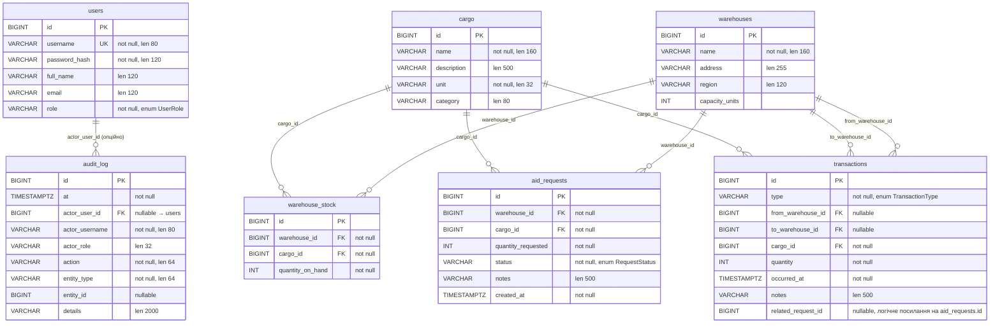

# ER-діаграма бази даних (Humanitarian Logistics)

Актуальна схема відповідає сутностям JPA (`com.humanitarian.logistics.model`) та таблицям PostgreSQL. Діаграму можна переглянути в GitHub, VS Code (розширення Mermaid) або [mermaid.live](https://mermaid.live).

## Логічна ER-діаграма (Mermaid)

## Обмеження та індекси

| Таблиця           | Обмеження / індекс |
|-------------------|--------------------|
| `warehouse_stock` | `UNIQUE (warehouse_id, cargo_id)` — один рядок залишку на пару склад + вантаж |
| `users`           | `UNIQUE (username)` |
| `audit_log`       | індекси: `at`, `(entity_type, entity_id)`, `actor_username` |

## Логічне посилання (не FK у JPA)

- У таблиці **`transactions`** поле **`related_request_id`** зберігає ідентифікатор заявки з **`aid_requests`** (зв’язок на рівні застосунку / бізнес-логіки, без окремого `@ManyToOne` у поточній моделі).

## Перелік enum-значень (для документації)

- **`UserRole`**: `ADMIN`, `COORDINATOR`, `OPERATOR`, `VIEWER`.
- **`TransactionType`**: `INBOUND`, `OUTBOUND`, `TRANSFER`.
- **`RequestStatus`**: `PENDING`, `APPROVED`, `REJECTED`, `FULFILLED`.

## Призначення `audit_log`

Фіксує **хто** (`actor_user_id`, `actor_username`, `actor_role`), **коли** (`at`), **що зробив** (`action`) і над **якою сутністю** (`entity_type`, `entity_id`, опційно `details`) — для прозорості змін транзакцій та статусів заявок тощо.
